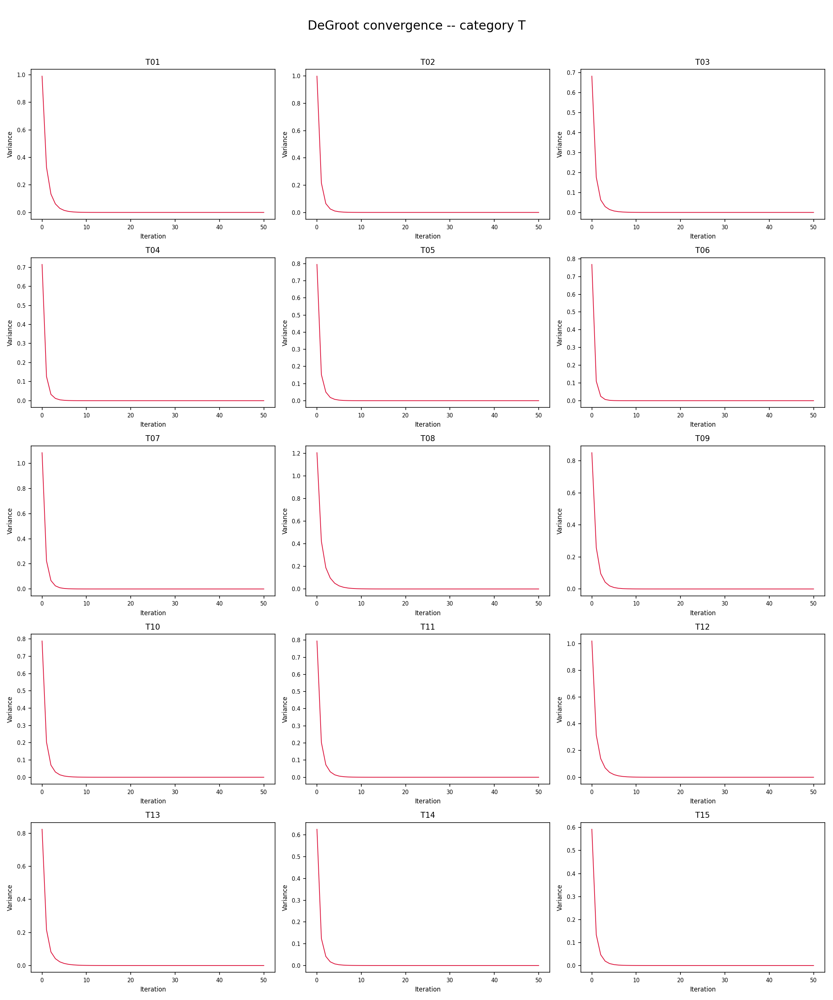
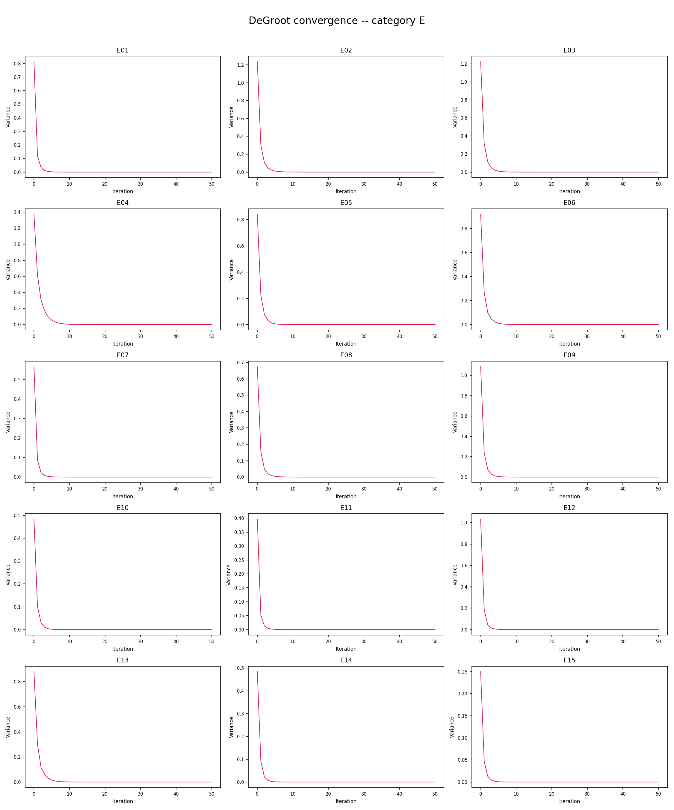
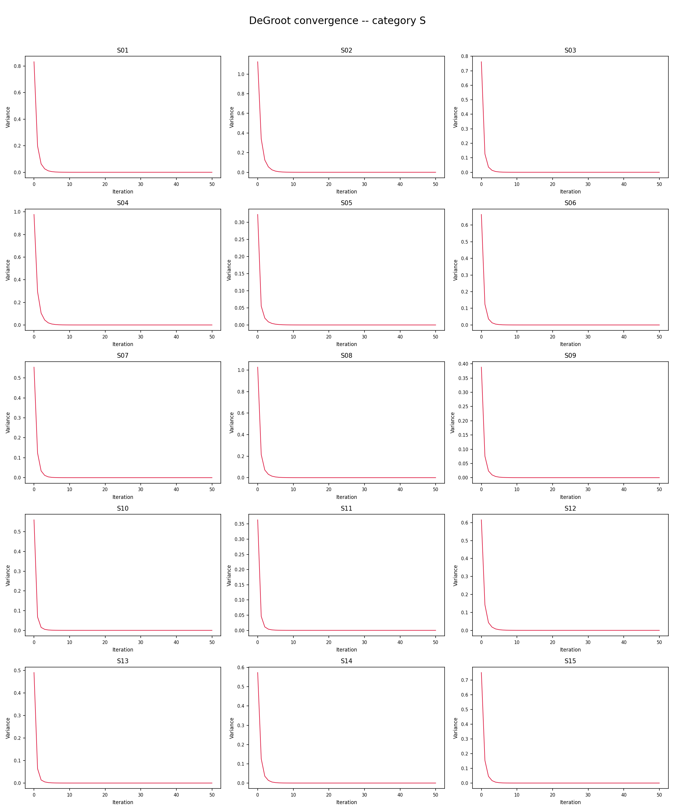
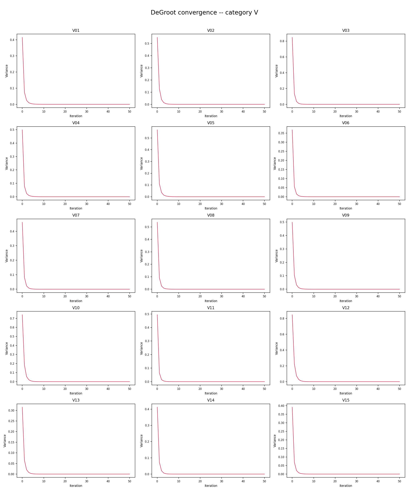
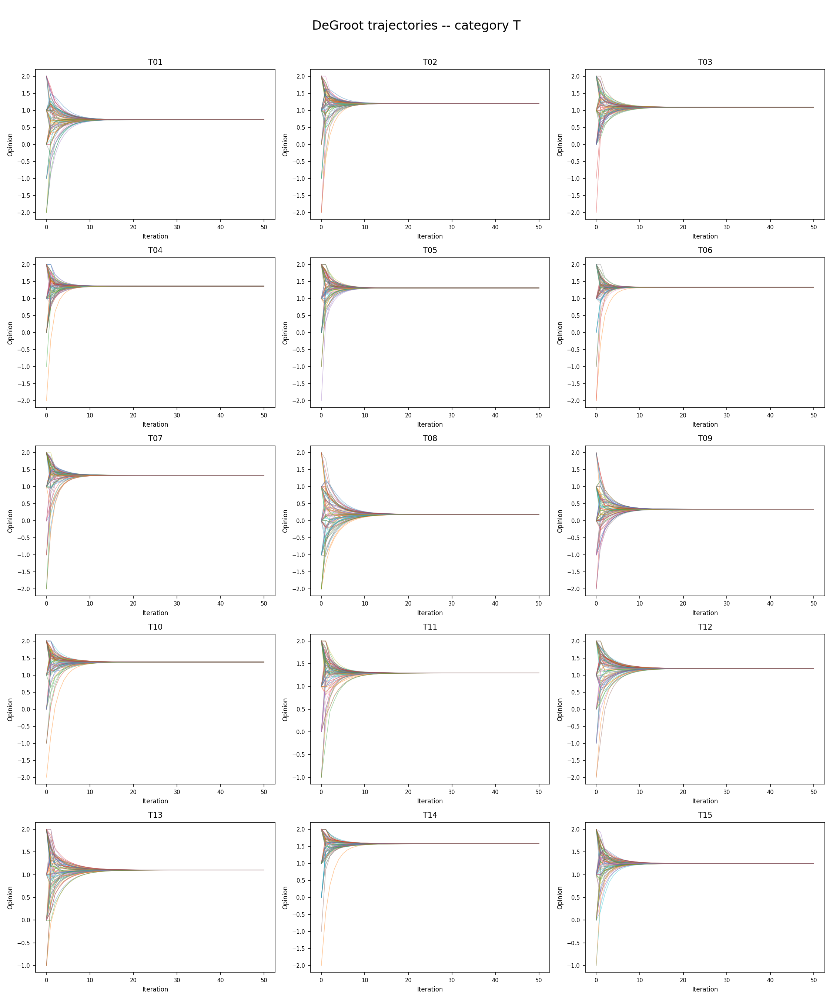
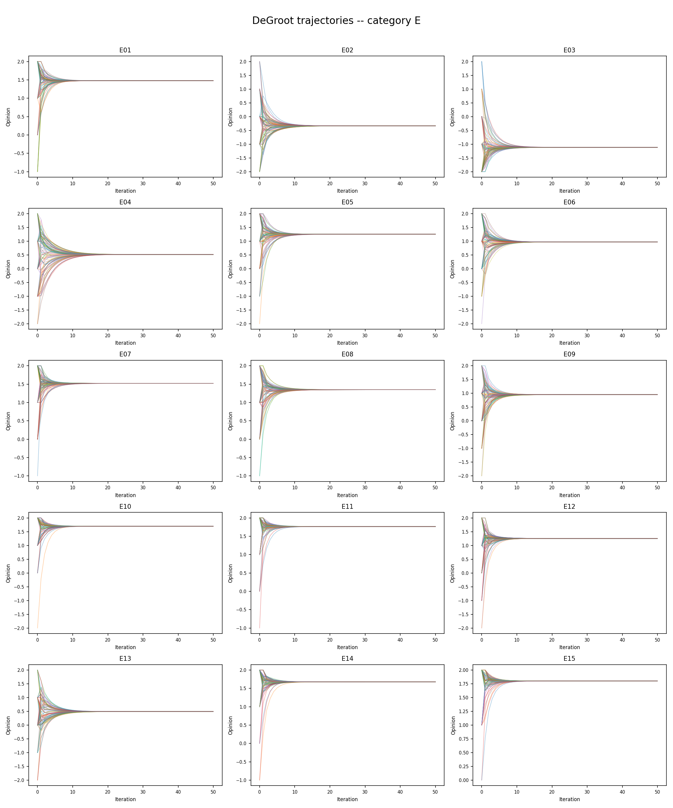
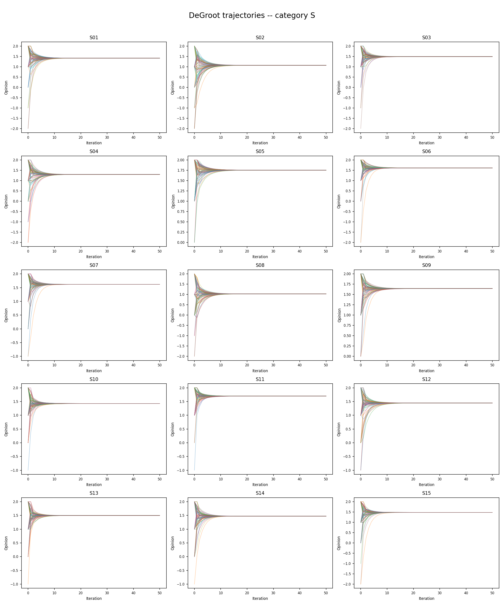
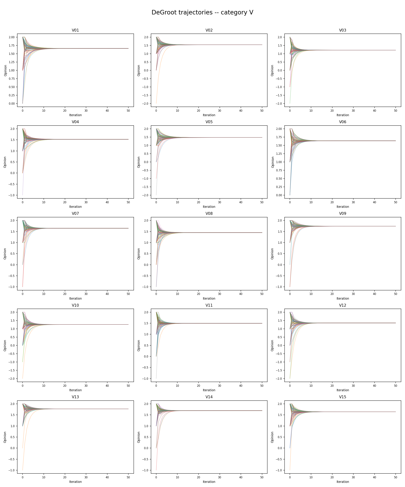

# Network Dynamics using DeGroot Model

## DeGroot Model

The DeGroot Model is a mathematical model on opinion networks where each node holds a numeric opinion and is repeatedly updated to a weighted average of its neighboring nodes.

It's a good method for studying whether a group's opinions remain divided or whether they settle in consensus, and if they settle in consensus, how slow or fast it happens.

## Preprocessing

Partially filled rows are due to incomplete form responses. We choose to drop them entirely.

## Methodology

We choose to use a translation of each of {Strong Disagree, Disagree, Neutral, Agree, Strong Agree} to {-2, -1, 0, 1, 2}.

Semantically, Neutral and No Comment would indicate different intentions, but to discard cells with No Comment for the sake of this graph (based on the method to be described below) would be of the same effect as treating No Comment as 0.

We treat each person's set of responses as a node, and we define bidirectional edges from each node to its nearest 3 nodes. The edge weights are calculated using cosine distance as the metric, on the two sets of responses between any two nodes. The network obtained stays fixed throughout the rest of the method.

We now simulate the DeGroot model on the resulting network across each question individually.

## Analysis

### Convergence and Trajectories

Despite the same underlying network, some questions converge faster than the others due to the initial answers themselves mostly agreeeing with each other.

### Analysis

With the kNN method that we've used with k=3, we get only a single connected component. This indicates that the general set of opinions at the start itself are mostly aligned with each other to begin with itself. With a low value of k, if the opinions were more conflicting, we would've see several connected components as opposed to just one.

Most of the questions converge to values in between Agree and Strongly Agree. The result is also supported by and should be expected from the distribution of responses on most questions.

In `dynamic_process/figures/item_summary.csv`, the values to which each of the questions' responses converge to can be seen, along with the raw average response prior to the simulation. If the converged value is lower than the raw averages, it indicates that the responses with value lower than the converged value are better connected. Similarly, if the converged value is higher, it means the nodes with a higher value as the response are connected better in the graph.