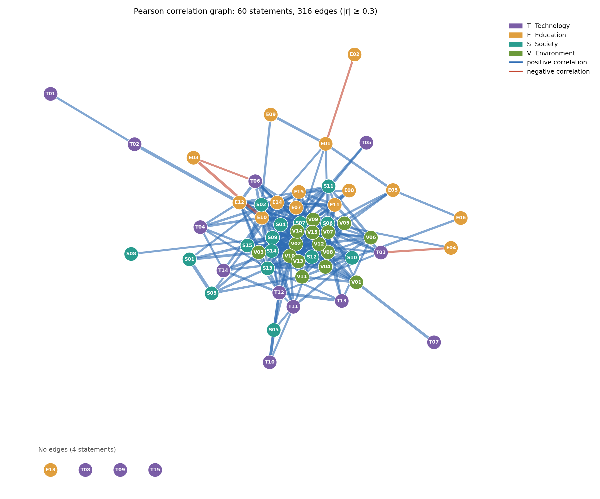
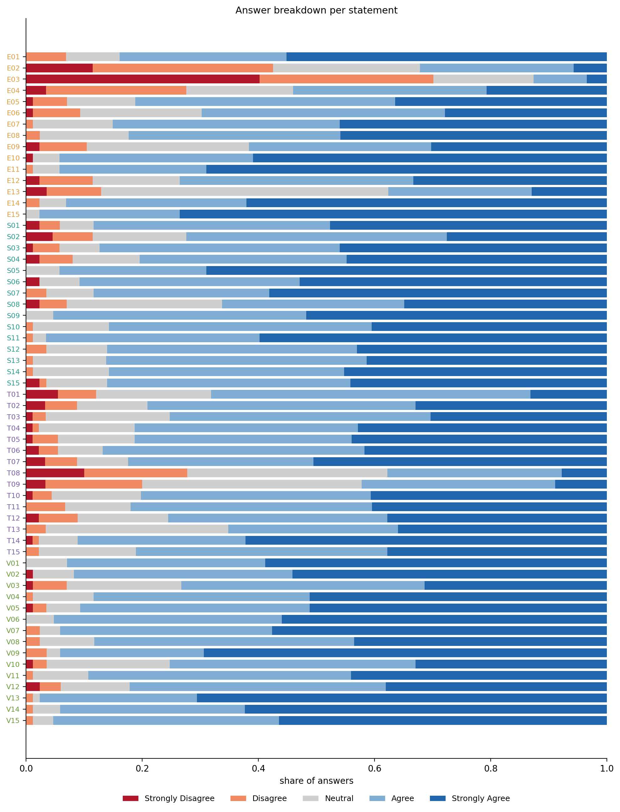
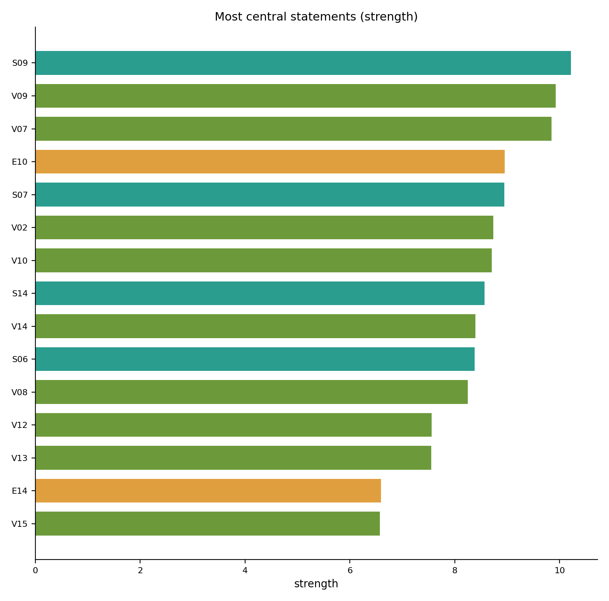
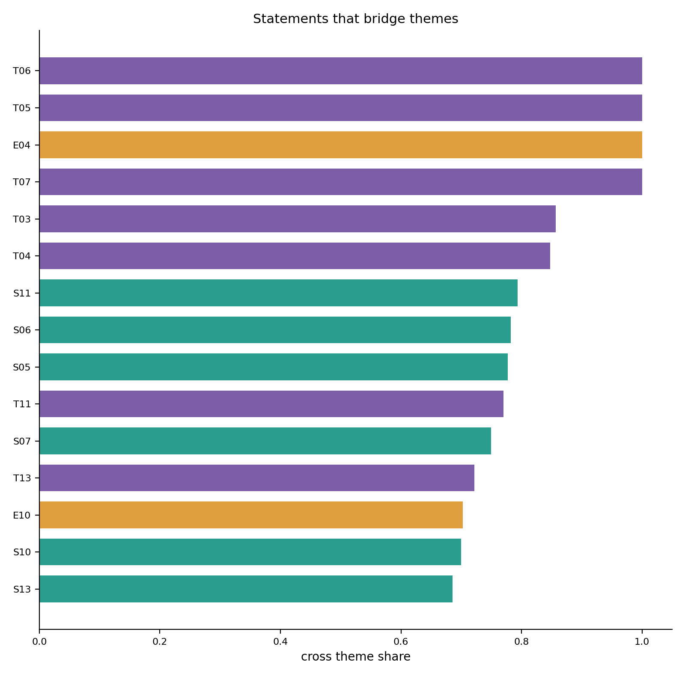
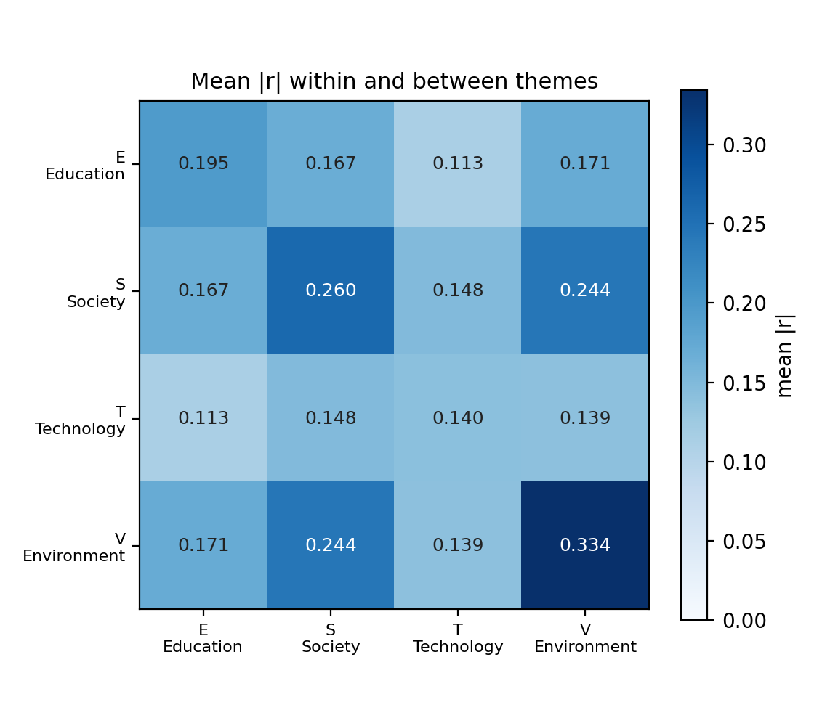
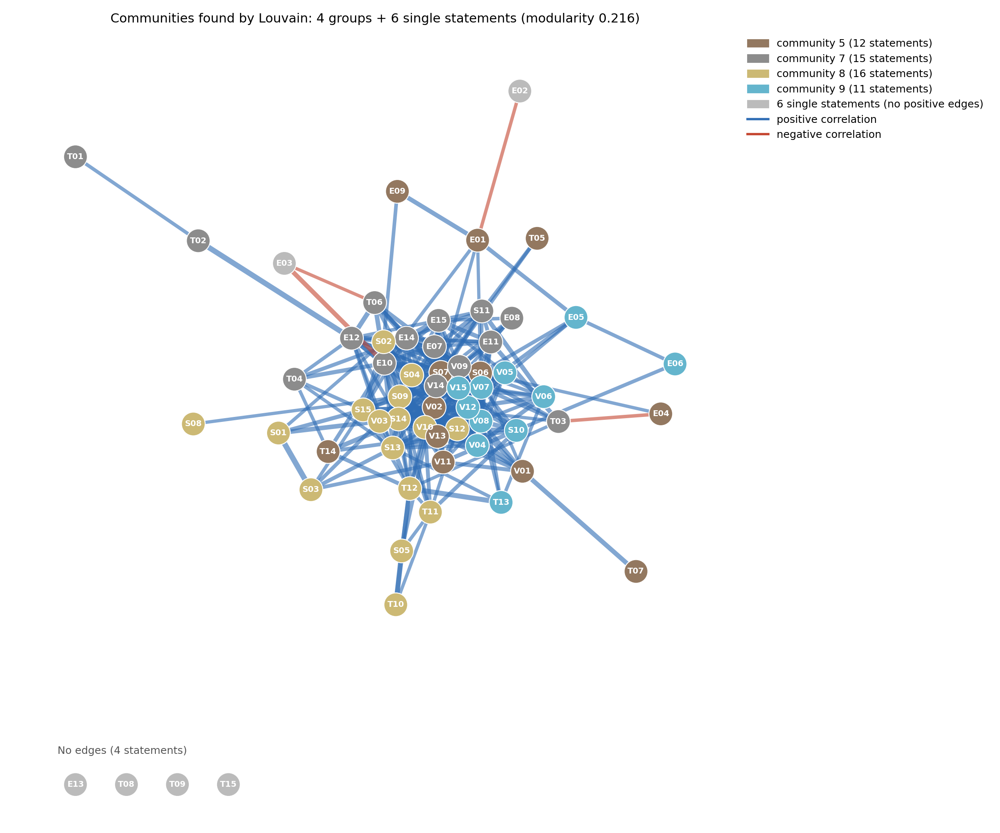
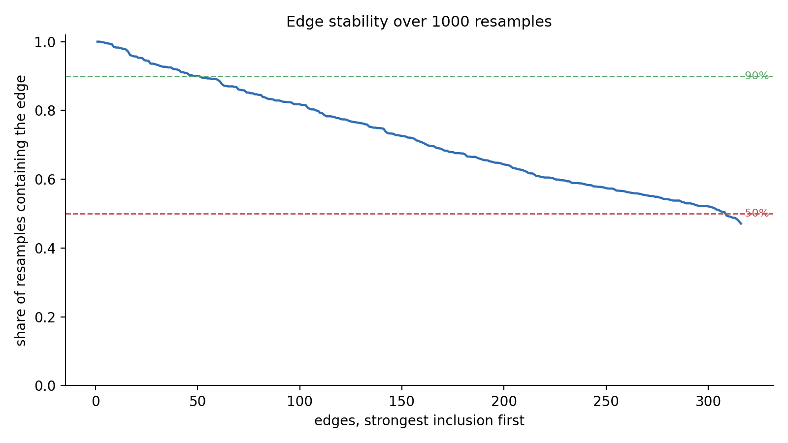
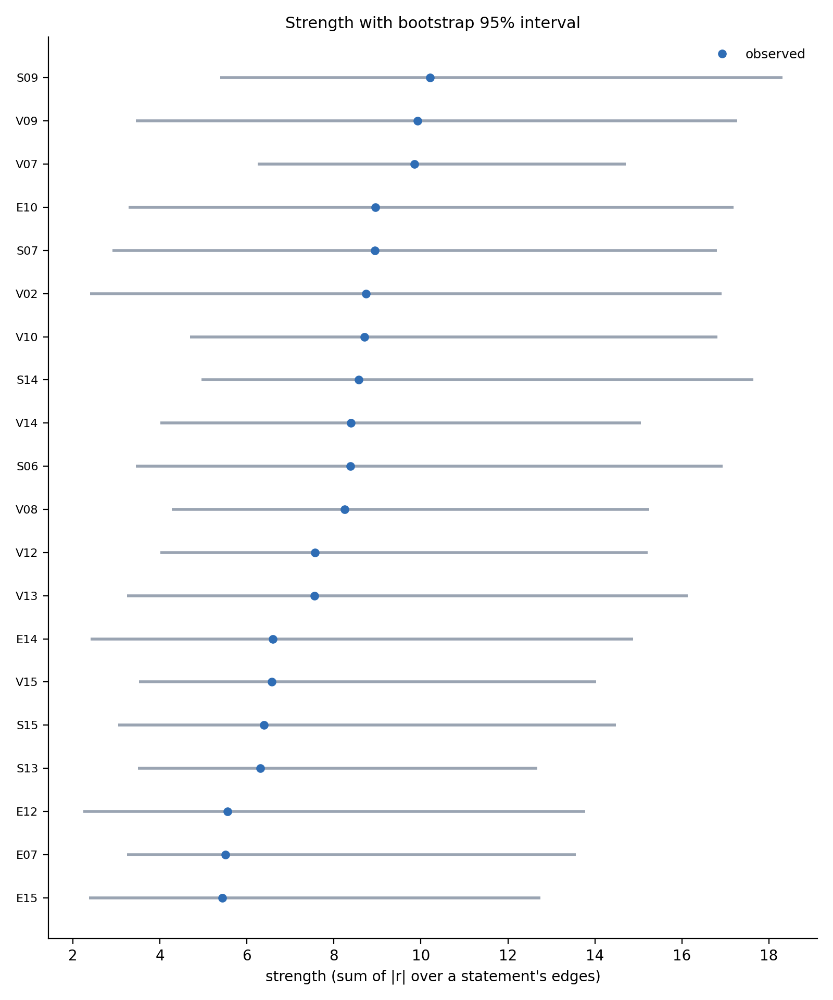

# Opinion Network from the Class Survey

We turned the class survey into a network of **statements**. Two statements are connected when the class answered them in a similar way. The network then tells us which opinions travel together, which statements sit at the centre, and whether the four survey themes hold up as real groupings.

---

# Part A : How the graph is built

## A1. The data

The survey has **96 responses** to **60 statements**, 15 each on Technology (T), Education (E), Society (S) and Environment (V).

We prepared it in three steps:

1. **Turned answers into numbers.** Strongly Disagree = 1, Disagree = 2, Neutral = 3, Agree = 4, Strongly Agree = 5.
2. **Treated "No Comments" as missing.** Someone choosing it declined to answer, which is not the same as being neutral. That affects 37 answers.
3. **Dropped 5 empty responses.** This leaves **91 respondents**. Of these, 68 answered all 60 statements. The rest skipped some, mostly towards the end of the survey.

## A2. The nodes

**Each node is one statement.** There are 60 statements, so there are 60 nodes. 

## A3. The edges

Two statements are linked when people who agree with one also tend to agree with the other. We measure that with the **Pearson correlation** between the two columns of answers:

$$r_{jk} = \frac{\sum_i (x_{ij} - \bar{x}_j)(x_{ik} - \bar{x}_k)}{\sqrt{\sum_i (x_{ij} - \bar{x}_j)^2}\sqrt{\sum_i (x_{ik} - \bar{x}_k)^2}}$$

where $x_{ij}$ is person $i$'s answer to statement $j$, and $\bar{x}_j$ is the average answer to that statement.

It gives a number between −1 and +1:

| $r_{jk}$ | Meaning |
|---|---|
| close to +1 | people who agree with one agree with the other |
| around 0 | the two statements are unrelated |
| close to −1 | people who agree with one disagree with the other |

Each pair is computed on the people who answered **both** statements. This means that later questions (which have fewer respondents) are thus naturally based upon those fewer people's responses.  

Number of respondents for each pair ranges from 91 in the beginning to 81 near the end.

## A4. The rule for keeping an edge

There are $\binom{60}{2} = 1{,}770$ pairs. Most of these, however, have low correlations and do not carry any information, so creating an edge for them does not make sense. 

**Our rule: keep the edge if |r| ≥ 0.3.**

It is a judgement call. Part B5 rebuilds the graph at other cutoffs to show how much rides on it, and Part B4 checks what happens when we redraw the sample itself.

The edge keeps the correlation as its **weight**.

## A5. The resulting graph

| | |
|---|---|
| Nodes | 60 statements |
| Edges | 316 |
| Density | 18% of all possible pairs |
| Positive edges | 312 |
| Negative edges | 4 |
| Statements with no edges | 4 (E13, T08, T09, T15) |
| Strongest edge | V07–V08, r = 0.63 |

**What the picture shows:**

- **One big cluster.** 56 of the 60 statements form a single connected group. Class opinions are broadly of a piece, not divided into separate islands.
- **Almost everything is positive.** Only 4 edges out of 316 are negative. Agreement with one idea nearly always goes with agreement with another.
- **Environment is the tightest region.** The strongest edges are nearly all V–V: biodiversity with sustainable campuses (0.63), reuse and repair with consumer choices (0.60).
- **Four statements stand alone.** E13 (research vs. infrastructure), T08 (AI diagnosis), T09 (self-driving cars) and T15 (dependence on AI). Part B1 explains why.

---

# Part B : Analyses

## B1. What does the class actually think?

First , we do an analysis of the raw answers to get a sense of the data (SMELL THE DATA).

We labelled each statement by how the answers fall:

| Label | Meaning | Count |
|---|---|---|
| **consensus** | 85%+ answered on one side | 31 |
| **mixed** | neither of the above | 26 |
| **split** | at least 25% agree *and* at least 25% disagree | 3 |

- **Near-unanimous:** E15 lifelong learning (98% agree), V13 corporate environmental accountability (98%), S11 free expression (97%).
- **Rejected:** E03 compulsory attendance is the only statement the class clearly opposes (due to obvious reasons), at 70% disagree.
- **Genuinely split:** only three. E04 online learning (54% agree, 28% disagree), E02 exams measure knowledge (32% vs. 43%), T08 AI diagnosis (38% vs. 28%).

Here we got the opposite of what we expected.
For high consensus statements, we expected them to have low variance and thus not give much useful information. Instead they turned out to be the hubs:

| Label | Average number of edges |
|---|---|
| consensus | 15.2 |
| mixed | 6.1 |
| split | 1.0 |

E15, which 98% of the class agreed with, has 14 edges. T08, which the class is genuinely split on , has none. E02 has exactly one.

There are probably two reasons for this: 
1. As the class probably holds a fairly coherent set of beliefs , related questions have similar answers and so have an edge correlation between them. 
2. The other , more unfortunate explanation is that since most of the answers (79%) are Agree or Strongly Agree , that leads to high agreement questions being seen as naturally significant to the rest of the graph. 

## B2. Which statements sit at the centre?

We measured three things per statement:
- **Degree:** how many edges it has.
- **Strength:** the sum of its edge weights, so both count and quality.
- **Cross-theme share:** how much of its strength goes to statements from other themes.

**The top five by strength:**

| Statement | Theme | Edges | Strength |
|---|---|---|---|
| S09 inclusive environment for differing viewpoints | S | 26 | 10.2 |
| V09 products designed for reuse and repair | V | 24 | 9.9 |
| V07 protecting biodiversity | V | 25 | 9.8 |
| E10 innovation over rote learning | E | 22 | 9.0 |
| S07 equal opportunities regardless of background | S | 24 | 8.9 |

These are the anchor beliefs. S09 is tied to 26 of the other 59 statements, more than any other, so it sits at the core of the class's shared outlook.

**Strength by theme** shows a clear ordering:

| Theme | Average strength |
|---|---|
| Environment | 6.7 |
| Society | 4.9 |
| Education | 3.0 |
| Technology | 1.5 |

Environmental opinions come as a package. Technology opinions do not: they are held far more independently of one another.

**E10** (innovation over rote learning) is the main connector in the graph. It has the highest betweenness, and 70% of its strength reaches outside Education. It links how students think about teaching to how they think about society and the environment.

## B3. Do the four survey themes hold up?

When building the graph, we didn't provide it with the inbuilt grouping of the 4 themes (Technology , Environment , Society and Education). Here, we test if the network can independetly recover them.

### The four-theme heat map

Average |r| within and between themes:

| | E | S | T | V |
|---|---|---|---|---|
| **E** | 0.195 | 0.167 | 0.113 | 0.171 |
| **S** | 0.167 | **0.260** | 0.148 | 0.244 |
| **T** | 0.113 | 0.148 | 0.139 | 0.139 |
| **V** | 0.171 | 0.244 | 0.139 | **0.334** |

Reading it:
- **Environment is the most coherent theme** at 0.334, well above everything else.
- **Society and Environment are close to each other** at 0.244, almost as strong as Society's internal coherence of 0.260. Students treat environmental questions as ethical questions.
- **Technology is not a real group.** Its internal number, 0.139, is *lower* than its link to Society, 0.148. Technology statements have more to do with ethics statements than with each other.

### Letting the graph find its own groups

We then ignored the labels and let a standard community-detection algorithm (Louvain) split the network by its edges alone. It found **4 groups**, plus 6 statements with no positive edges.

| Group | Size | Composition | What it looks like |
|---|---|---|---|
| A | 16 | 11 S, 3 T, 2 V | Ethics and fairness, pulling in data-privacy items |
| B | 15 | 7 E, 5 T, 2 V, 1 S | Education and technology together: AI in teaching, curriculum |
| C | 11 | 7 V, 2 E, 1 S, 1 T | Sustainable practice and consumption |
| D | 12 | spread across all four | General civic and responsibility statements |

The groups clearly **do not** reproduce the survey's four themes. Agreement scores are low: NMI 0.26 and ARI 0.15, where 1 means identical and 0 means unrelated.

Group B is the clearest example. It merges Education and Technology, because to this class "AI in education" is one topic, not two.

### Are the themes structure at all?

The found groups score higher than the themes as a way of splitting the graph: modularity 0.216 against 0.127.

But that doesn't make the themes meaningless. We compared the themes against 10,000 random splits of 60 statements into four groups of 15. The themes beat essentially all of them, with **p = 0.0001**.

**So the answer is layered.** The themes are real structure, just not the *best* description. Opinions organise around topic to a degree, and around broader attitudes more strongly.

## B4. Is the graph real, or is it noise?

We have drawn a lot of conclusions from 91 respondents. That is a small sample, and a lot of the conclusions we draw may be noise. 

To test this,  we use a standard method called **bootstrapping**:

1. **Draw a new set of 91 respondents from the 91 we have, with repeats allowed.**
2. **Rebuild everything from that set:** all 1,770 correlations, then the same |r| ≥ 0.3 rule, giving a fresh graph.
3. **Repeat 1,000 times.**

The repeats are what make this work. Each draw picks some people two or three times and leaves out roughly a third of the class, so every rebuilt graph comes from a slightly different mix of students. That is the same kind of variation we would see if a different 91 people had answered the survey. Running it 1,000 times shows us which parts of our graph stay put and which ones move.

For each edge, we count how many of the 1,000 graphs it appears in:

| | Count |
|---|---|
| Our edges | 316 |
| Appear in over 90% of the graphs | 50 |
| Appear in over 75% | 137 |
| Appear in under 50% | 8 |
| Median edge | appears 71% of the time |

The strong edges never move. V07–V08 and V08–V10 appear in all 1,000 graphs. The weak ones flicker: an edge at r = 0.31 sits right on the line, and swapping a few respondents pushes it under about half the time. The same thing happens in reverse, with 11 pairs just below our cutoff turning up in more than half the graphs.

The hubs hold up much better than individual edges. If we rank all 60 statements by strength in each of the 1,000 graphs, those rankings match our reported one with a correlation of 0.82 on average, and 0.64 even in the worst 5% of cases. S09, V09 and V07 stay at the top throughout.

So we can confidently name the hubs and describe the overall shape of the graph, but we cannot claim that any one weak edge is real.

## B5. Is 0.3 an arbitrary cutoff?

Yes, it is kind of an arbitrary cutoff. It was chosen because it was standard. But , to test the effect of the cutoff , we rebuild the graph using 4 other cutoffs to see what changes. 

| Cutoff | Edges | Statements with no edges |
|---|---|---|
| 0.25 | 486 | 0 |
| **0.3** | **316** | **4** |
| 0.35 | 187 | 10 |
| 0.4 | 116 | 12 |

The graph gets denser or sparser, as you would expect, but the story it tells does not change. Ranking the statements by strength at 0.25 and at 0.35 gives orderings that correlate 0.98 and 0.97 with the one we report, and S09 and V09 stay in the top five at every cutoff.

## B6. Limitations

1. **Correlation is not causation.** An edge tells us two opinions move together in this class. We cannot tell whether one belief has a causal implication on the other.
2. **Answering style inflates the graph.** 79% of all answers were Agree or Strongly Agree. Anyone who ticks Agree down the whole page creates edges between statements that have nothing in common, which is the effect we ran into in B1.
3. **The cutoff is a judgement call.** We chose 0.3, and B5 shows the main conclusions hold anywhere between 0.2 and 0.4. Still, we rest our claims on the edges that survive resampling and treat the borderline ones as provisional.

---

# What the network says about the class

1. **This class agrees with itself.** 312 of our 316 edges are positive, and half the statements draw 85% or more of the class to one side. Opinions here reinforce each other far more often than they pull apart.
2. **Ethics anchors everything.** The hubs are inclusion, equal opportunity and environmental responsibility, not any technical position. Students build their views outward from values.
3. **Environmental views travel as a set.** Back one green statement and you almost certainly back the rest, and those views sit so close to the ethics statements that the two themes nearly merge.
4. **Technology is the exception.** Its statements barely connect to each other, and the three about handing decisions to AI (diagnosis, self-driving cars, growing dependence) connect to nothing at all. This class has settled on its ethics and is still arguing about its technology.
5. **Education splits down the middle.** Its teaching-and-curriculum statements group with technology, while its values statements group with ethics. Students file "AI in the classroom" under technology, not education.
6. **We disagree about rules, not principles.** Attendance, exams and online learning draw the sharpest divisions, and all three sit at the fringe of the graph. Our disagreements are about how the university runs, and they never reach the values underneath.
