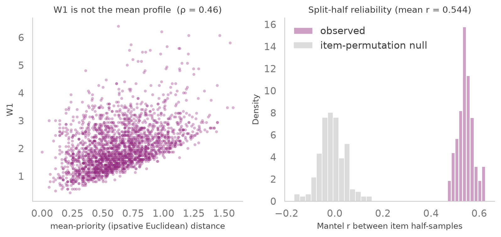
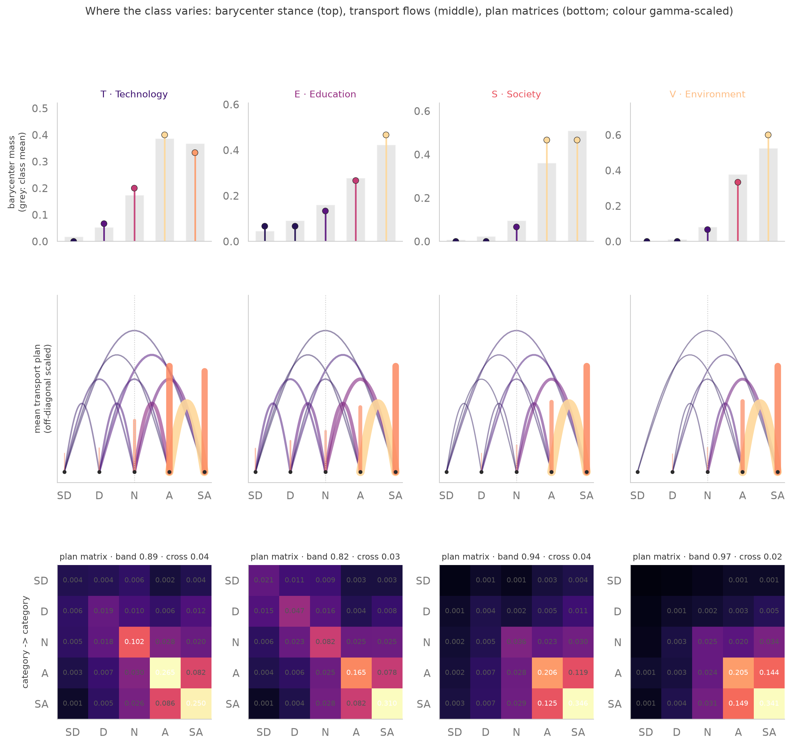
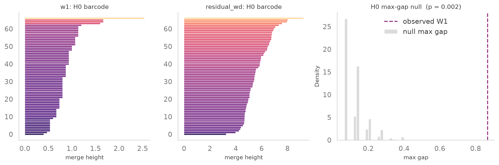
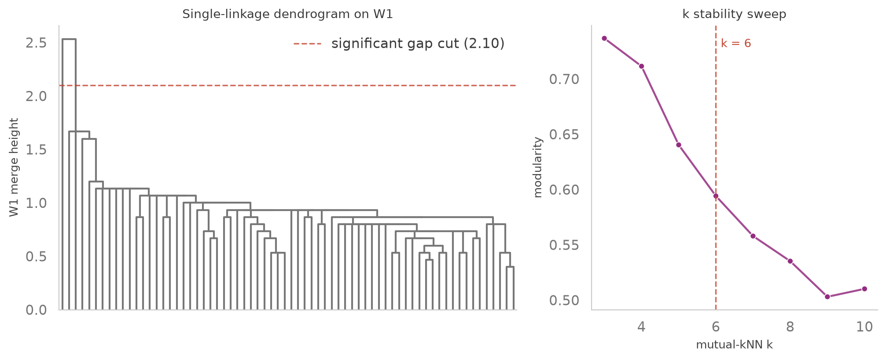
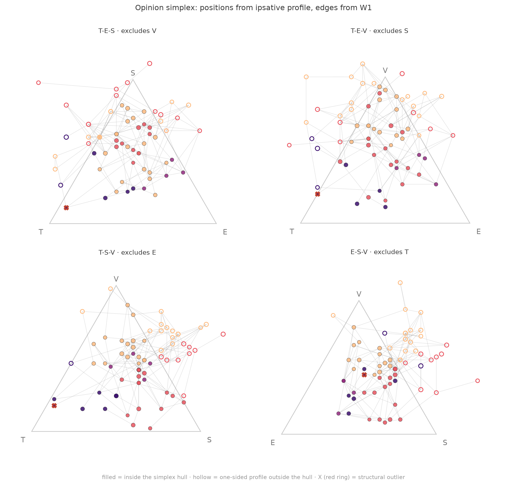
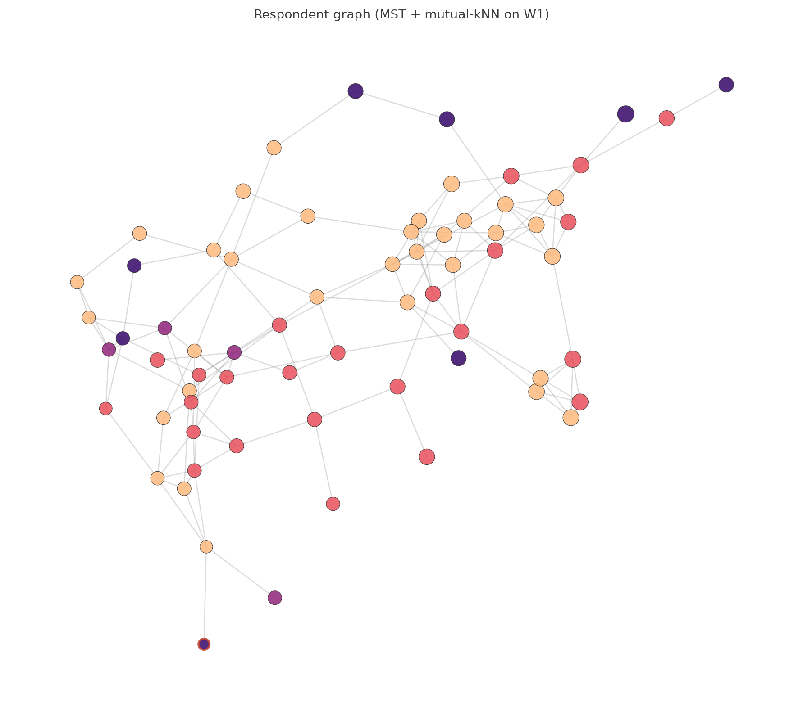
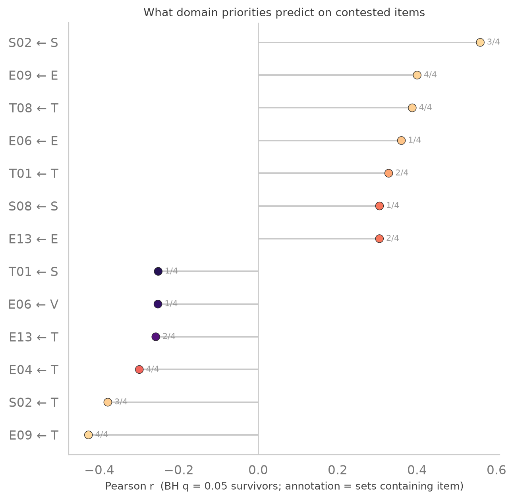
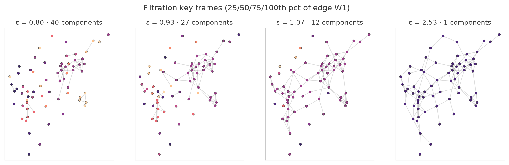

# Respondent Graph

A respondent network built from the class survey. Nodes are the 68 complete-case
respondents; the metric between them is a sum over the four themes of the exact
Earth-Mover's Distance between per-theme ordinal answer histograms on the
|c − c′| cost. Edges are MST + mutual-kNN on that metric. Analysis layers:
transport plans and barycenters (where the class varies on the scale), Vietoris–
Rips persistent homology with a column-permutation null (factions / loops),
structural outliers, a lossless opinion-simplex geometry, and a robustness grid
over every discretionary choice.

This is the dual of [`../questions_as_nodes`](../questions_as_nodes) (items as
nodes, graphical-lasso partial correlations): that pipeline analyzes the
columns of the response matrix, this one the rows. Together the two cover both
spaces of the survey without sharing an estimator.

## Theoretical background

### 1. Data and the filter cascade

Answers are encoded SD=1 … SA=5; blanks and "No Comments" are missing (never
imputed to Neutral). The cascade is stated once in
[`01_prepare.py`](01_prepare.py) and audited per subset in
[`outputs/diagnostics.json`](outputs/diagnostics.json):
**96 file rows → 91 non-blank → 87 with ≥40 answered → 68 complete cases**.
The primary analysis uses n = 68 (no missingness inside the measures); 87 and
91 appear only as robustness cells, because partial responders change histogram
denominators and hence metric scale.

### 2. Respondents as measures

Each respondent i becomes four probability measures — one per theme d — the
5-bin ordinal histogram $\mu_i^{(d)}$ of their answers. Keeping the response
*shape* is the point: a mean score destroys it (two people with mean 3.4 can be
"mostly Neutral" or "half Disagree / half Strongly Agree"). Distances that
ignore the scale's order (total variation, χ²) treat Neutral→Agree and
Neutral→Strongly-Disagree as equally far; a ground cost $M_{cc'} = |c - c'|$
does not. Step 02 also emits the ipsative profile (row-centered theme means,
rows sum to 0) and extremity (mean |x − 3|) as interpretable companions.

### 3. The W₁ metric and its gate

The respondent distance aggregates per-theme optimal transport:

$$D_{ij} = \sum_{d \in \{T,E,S,V\}} W_1\!\left(\mu_i^{(d)}, \mu_j^{(d)}\right),
\qquad
W_1(\mu,\nu) = \min_{\pi \in \Pi(\mu,\nu)} \sum_{c,c'} |c-c'|\, \pi_{cc'}$$

On a 1-D ordinal grid this [Kantorovich
program](https://en.wikipedia.org/wiki/Optimal_transport) has an exact closed
form — $W_1(\mu,\nu) = \sum_c |F_\mu(c) - F_\nu(c)|$, the L1 distance between
CDFs — and the pipeline computes both: the closed form for speed, `ot.emd2`
([POT](https://pythonot.github.io/)) as a cross-check. They agree to 4.4e-16
(recorded in [`outputs/metric_validation.json`](outputs/metric_validation.json)).

Two validations keep the metric honest (step 03):

- **Non-degeneracy gate.** Spearman ρ of D against the plain mean-priority
  (ipsative Euclidean) distance must stay **< 0.85**; observed **0.459**. OT is
  measuring something the mean does not, otherwise steps 04–08 would be
  redundant machinery. `run.sh` enforces this gate and aborts if it fails.
- **Negative control.** The discarded alternative — respondents as measures
  over all 60 statements with a random ground cost — collapses into cosine
  similarity (ρ = 0.92). Documented so the reviewer sees the failure mode we
  designed against.
- **Split-half reliability.** 100 stratified item half-splits rebuild D twice;
  the halves correlate at Mantel r = 0.544 against an item-permutation null of
  −0.01 (z = +10.2, p = 0.005).

### 4. Transport plans and barycenters

A distance tells you *how far*; the optimal plan $\pi^{*}_{ij}$ tells you
*where on the scale* the distance lives. Step 04 averages plans over all pairs
per theme, $\bar\pi^{(d)}$, and computes the fixed-support
[Wasserstein barycenter](https://en.wikipedia.org/wiki/Wasserstein_metric) —
the Fréchet mean under W₁ — as a linear program. Read the flow matrix's
off-diagonal: mass moved between adjacent categories = an *engagement* gap;
mass crossing the midpoint = a *direction* gap.

### 5. Persistent homology: factions and loops

The [Vietoris–Rips complex](https://en.wikipedia.org/wiki/Vietoris%E2%80%93Rips_complex)
$R_\varepsilon$ connects respondents at W₁ ≤ ε and grows with ε
([ripser](https://github.com/Scikit-TDA/ripser.py)). Its persistent homology
answers two questions no single clustering can:

- **H₀ (components) is the single-linkage dendrogram**: one structure that
  shows the faction question at *every* threshold simultaneously — no k, no
  resolution parameter, no seed. Significant merge-height gaps are scored
  against a column-permutation null (500 draws: each item's answers permuted
  independently, preserving marginals, destroying alignment).
- **H₁ (loops)** detects an ideological *spectrum/horseshoe* — a structure no
  clustering method of any kind can see, because clusters can't detect a hole.

[Louvain](https://networkx.org/documentation/stable/reference/algorithms/generated/networkx.algorithms.community.louvain_communities.html)
appears only as a deliberately fragile comparison: it *always* returns tidy
communities, so the interesting statistic is how far its modularity exceeds
the same null, and whether its partitions replicate across item half-samples
(ARI) — not the communities themselves. A witness complex
([gudhi](https://gudhi.inria.fr/)) replaces Rips in the robustness grid.

### 6. The opinion simplex

Ipsative profiles sum to zero across four themes → only 3 free dimensions → a
barycentric embedding in a regular tetrahedron is **lossless** (Step 08;
[`outputs/geometry.json`](outputs/geometry.json) is the data contract for the
viewers). Node positions come from the profile; **edges come from W₁** — the
visible long edges crossing the simplex are people with similar theme
priorities but different response shapes, i.e. the visual proof of ρ = 0.459.
Respondents whose profiles leave the simplex hull render **hollow** (a one-sided
profile: e.g. someone whose weakest theme weight goes negative); nodes inside
are filled. That boundary is information, not an artifact.

### 7. Validity, testing, robustness

Priority scores are validated by repeated stratified split-half reliability
(null-referenced z) and held-out-theme regression with permutation p-values.
Priority → contested-item regressions face [Benjamini–Hochberg](https://en.wikipedia.org/wiki/Benjamini%E2%80%93Hochberg_procedure)
FDR at q = 0.05 *within every reported set*. Step 10 sweeps every discretionary
choice — filter (68/87/91) × ground cost (|c−c′| / (c−c′)²) × aggregation
(sum/max/weighted) × complex (Rips/witness) × metric (W₁ / residual Euclidean)
— 24 cells, each with its own null, checking that verdicts, not just numbers,
are stable. The full reading lives in
[`outputs/robustness_summary.json`](outputs/robustness_summary.json).

## Run

Easiest — the whole pipeline (deps probe, 12 steps, gate check, summary):

```bash
./run.sh              # incremental
./run.sh --fresh      # wipe outputs/ and figures/ first
```

Or step by step, with the `dpcn` conda environment:

```bash
conda run -n dpcn pip install -r requirements.txt
conda run -n dpcn python 01_prepare.py
conda run -n dpcn python 02_measures.py
conda run -n dpcn python 03_ot_metric.py     # GATE: rho vs mean-priority < 0.85
conda run -n dpcn python 04_plans_barycenter.py
conda run -n dpcn python 05_persistence.py
conda run -n dpcn python 06_h0_factions.py
conda run -n dpcn python 07_outliers.py
conda run -n dpcn python 08_geometry.py
conda run -n dpcn python 09_priority_validity.py
conda run -n dpcn python 10_robust.py
conda run -n dpcn python 11_interactive.py
conda run -n dpcn python 12_filtration.py
```

Each step reads the previous steps' files from `outputs/`. Full runtime ≈ 2
minutes. `outputs/` and `logs/` are regenerable and git-ignored; `figures/` is
tracked so this README renders on GitHub.

## Pipeline layout

| File | Does | Writes |
|---|---|---|
| [`01_prepare.py`](01_prepare.py) | encodes SD..SA→1..5, blank/"No Comments"→NA, filter cascade, per-subset diagnostics | `clean.parquet`, `all_responses.parquet`, `items.csv`, `diagnostics.json` |
| [`02_measures.py`](02_measures.py) | 4×5 ordinal histogram stack, ipsative profiles, extremity | `measures.npy`, `answered.npy`, `profiles.csv`, `extremity.csv`, `measures_info.json` |
| [`03_ot_metric.py`](03_ot_metric.py) | exact EMD (`ot.emd2`) = CDF-L1 (checked ~1e-16), split-half, negative control; **gate ρ < 0.85** | `W1.npy`, `metric_validation.json`, fig 03 |
| [`04_plans_barycenter.py`](04_plans_barycenter.py) | mean transport plans per theme, fixed-support W₁ barycenters (LP) | `flows.npy`, `barycenters.csv`, `flows_info.json`, fig 04 |
| [`05_persistence.py`](05_persistence.py) | Rips H0/H1 on W₁ + residual metrics vs column-permutation null, bootstrap CIs | `dgms.pkl`, `null_max_gap.npy`, `null_h1_max.npy`, `persistence_stats.json`, fig 05 |
| [`06_h0_factions.py`](06_h0_factions.py) | single-linkage dendrogram, significant gaps, faction verdict, Louvain comparison, k sweep | `dendrogram.json`, `faction_verdict.json`, fig 06 |
| [`07_outliers.py`](07_outliers.py) | isolated-H0-component outliers, characterized against class baselines | `outliers.csv`, `outliers.json` |
| [`08_geometry.py`](08_geometry.py) | lossless tetrahedron simplex; edges from W₁, positions from profile; viewer contract | `geometry.json`, figs 08 |
| [`09_priority_validity.py`](09_priority_validity.py) | split-half priority reliability, held-out-theme prediction, priority→contested-item regressions with BH-FDR | `validity.csv`, `prediction.csv`, `validity_info.json`, fig 09 |
| [`10_robust.py`](10_robust.py) | grid: filter × cost × aggregation × complex × metric, verdict stability | `robustness_grid.csv`, `robustness_summary.json` |
| [`11_interactive.py`](11_interactive.py) | offline vanilla-JS force graph (settle/drag/freeze, hover cards) + plotly 3D simplex | `figures/interactive/graph_2d.html`, `simplex_3d.html` |
| [`12_filtration.py`](12_filtration.py) | ε-sweep timelapse of the edge filtration vs the H0 barcode | `figures/interactive/filtration.html`, `12_filtration.mp4`, fig 12 |

Logic lives in [`rn/`](rn); the numbered scripts are thin wrappers. Settings
(seeds, null sizes, k, thresholds) live in [`rn/config.py`](rn/config.py);
figure style (seaborn white theme, magma palette, domain colors = 4 magma
samples, translucency) lives in [`rn/viz.py`](rn/viz.py). Steps 11–12 are
presentation-layer consumers of existing outputs and change no numbers.

## Figures and interpretation

### The metric is real — [03_validation.png](figures/03_validation.png)



*What you see:* W₁ distances against mean-priority distances (left) and the
split-half reliability distribution against its null (right).
*How to read it:* wide vertical scatter at fixed x = respondents with the same
theme priorities but different response shapes. *Numbers:* ρ = 0.459 (gate
< 0.85, pass); split-half r = 0.544, null −0.01, z = +10.2.

### Where the class varies — [04_flows.png](figures/04_flows.png)



*What you see:* per theme — the W₁ barycenter's stance (lollipop, against the
class-mean backdrop), the mean transport plan as a braid (strand width ∝ mass,
off-diagonal scaled), and the annotated 5×5 plan matrix (colour γ-scaled).
*How to read it:* strands hugging N→A→SA = enthusiasm gaps; strands crossing
the dotted midpoint = direction gaps. *Numbers:* band mass 0.82–0.97 vs
midpoint-crossing ≤ 0.04 — **the class varies in enthusiasm, not direction**.

### The topology of opinion — [05_barcodes.png](figures/05_barcodes.png)



*What you see:* H0 barcodes for W₁ and the within-domain residual metric, plus
the max-gap null distribution.
*How to read it:* one long bar = one respondent staying isolated until a large
ε; many short bars = one diffuse continuum. *Numbers:* max gap z = +10.8,
p = 0.002, and the split it induces is 67/1 — a singleton, not factions; H₁
max persistence z = +1.4, p = 0.25 — **no loops, no ideological spectrum** in
W₁ space (loops do appear in residual Euclidean space — an honest sensitivity
recorded in the robustness grid).

### No factions at any scale — [06_dendrogram.png](figures/06_dendrogram.png)



*What you see:* the H0 dendrogram with the significant-gap cut (red dashed)
and the mutual-kNN k stability sweep.
*How to read it:* both significant gaps isolate single respondents (64/1/1/1/1
at ε=1.4, then 67/1 at ε=2.1) — no split ever yields two groups of size ≥ 3.
*Numbers:* verdict **no_factions**; Louvain Q = 0.59 vs null 0.56 (z = +1.4),
item-subsample ARI = 0.23, only 0.5% of pairs co-assigned > 80% — Louvain's
"communities" do not replicate, which is the point of the comparison.

### The structural outlier — [outliers.csv](outputs/outliers.csv)

*What it is:* respondents isolated as their own H0 component beyond the
significant gap, characterized against class baselines. *Finding:* exactly one
— **respondent 119 (file row 90)**: 32 Neutral / 22 Agree / 6 Disagree /
0 Strongly Agree (the only zero-SA complete case), extremity 0.47 vs class
1.35, the most Technology-prioritizing profile in the class (+0.53 vs class
mean −0.15). A textbook midpoint responder.

### The opinion simplex — [08_ternary_panel.png](figures/08_ternary_panel.png)



*What you see:* the four tetrahedron faces (fixed affine views — nothing
clipped); positions from profiles, edges from W₁. *How to read it:* filled
nodes sit inside the simplex hull; **hollow** nodes are one-sided profiles
beyond it; long edges crossing the interior connect like-minded-on-priorities,
different-on-shape respondents. *Numbers:* 39–43 inside vs 25–29 outside per
face; MDS stress of W₁ in 3D is 161.8 (the W₁ space is *not* 3-D embeddable —
hence the computational topology instead of eyeballing a projection);
ρ(W₁, simplex distance) = 0.459.

### The respondent graph — [08_graph_fr.png](figures/08_graph_fr.png)



*What you see:* the 137-edge MST ∪ mutual-kNN(k = 6) graph; node colour =
dominant theme, size = extremity, red ring = the outlier.
*How to read it:* one connected continuum with no deep structural cleavage;
the long MST edges are the respondents furthest from everyone (id 119's edge
is the longest, 6.4 vs median 0.53).

### What priorities predict — [09_prediction.png](figures/09_prediction.png)



*What you see:* every BH-surviving correlation between a theme priority and a
contested item, coloured by adjusted p, annotated with contested-set
membership. *Numbers:* S-priority → S02 community service +0.56 (p ≈ 7e-7);
T-priority → E09 collaborative learning −0.43 and → T08 AI diagnosis +0.39;
E-priority → E09 +0.40. Technology- and Education-prioritizers divide on
collaborative learning — the one substantive axis the contested items expose.

### The filtration in motion — [12_filtration_frames.png](figures/12_filtration_frames.png)



*What you see:* the ε-sweep at the 25/50/75/100th percentiles of edge W₁;
nodes recolour by connected component. *How to read it:* components merge
continuously (no phase where two sizeable camps persist) — the animated
version of the no-factions verdict. The interactive scrubber is
[filtration.html](figures/interactive/filtration.html) and the video is
[12_filtration.mp4](figures/12_filtration.mp4).

## Interactive viewers

- [graph_2d.html](figures/interactive/graph_2d.html) — offline physics force
  graph (open locally in any browser; no server, no internet needed). Settles
  on load; drag a node and its neighbourhood relaxes; freeze/reheat/reset in
  the top bar. Hover a node (id, file row, dominant theme, extremity, profile,
  outlier flag) or an edge (both ids, W₁, weight).
- [simplex_3d.html](figures/interactive/simplex_3d.html) — self-contained
  plotly orbit camera on the lossless tetrahedron embedding (4.8 MB, offline).
  Positions are fixed by design — physics would destroy the geometry.
- [filtration.html](figures/interactive/filtration.html) — ε slider + play
  over the edge filtration with the H0 barcode and live component count.

## Key results (primary n = 68)

- **Metric is not redundant**: ρ(W₁, mean-priority) = 0.459 (gate < 0.85);
  split-half z = +10.2; the discarded 60-dim formulation collapses into cosine
  (ρ = 0.92) and is kept as the negative control. ([fig 03](#the-metric-is-real--03_validationpng))
- **The class varies in enthusiasm, not direction**: 82–97% of transport mass
  stays in the N–A–SA band; ≤ 4% crosses the midpoint. ([fig 04](#where-the-class-varies--04_flowspng))
- **No factions at any scale**: significant H0 gaps isolate single respondents
  only; Louvain barely beats its null (Q 0.59 vs 0.56) and does not replicate
  (ARI 0.23, 0.5% stable pairs). ([fig 06](#no-factions-at-any-scale--06_dendogrampng))
- **No loops in W₁** (H₁ p = 0.25): no ideological spectrum; loops in the
  residual metric and at n = 87/91 are recorded honestly as sensitivities.
  ([fig 05](#the-topology-of-opinion--05_barcodespng))
- **One structural outlier**: id 119 (row 90), the zero-Strongly-Agree midpoint
  responder, most Technology-prioritizing profile in the class.
  ([outliers.csv](outputs/outliers.csv))
- **Priorities are valid and predictive**: split-half null z = +5.6; held-out
  theme r = 0.46–0.76; headline BH survivors as in fig 09. ([fig 09](#what-priorities-predict--09_predictionpng))
- **All verdicts robust**: 24-cell grid — no-factions stable at n = 68/87 in
  every cost/aggregation cell; the two n = 91 "factions" flags isolate the
  size-4 partial-responder group; priority validity stable throughout.
  ([robustness_summary.json](outputs/robustness_summary.json))

## Contested-item sets (step 09)

Contestedness is defined at n = 87 (max coverage): minority share
min(P(agree), P(disagree)) ≥ 0.10 gives 10 items; top-10 normalized answer
entropy agrees on 8 of them (the **core-8** headline set). Entropy-only
admissions (S08, E06) are one-sided-consensus items with intensity spread —
reported as a definitional sensitivity, as are the minority-only T01/E13 and
the 7-item n = 68 set (mandatory filter-sensitivity row). BH-FDR q = 0.05 is
applied within every reported set; full table in
[`outputs/prediction.csv`](outputs/prediction.csv).

## References

- [POT: Python Optimal Transport](https://pythonot.github.io/) — Flamary et
  al. (the `ot.emd2` solver and barycenter machinery)
- [Computational Optimal Transport](https://optimaltransport.github.io/) —
  Peyré & Cuturi (foundations; free online)
- [ripser.py](https://github.com/Scikit-TDA/ripser.py) — Bauke et al. (Vietoris–Rips persistence)
- [The GUDHI library](https://gudhi.inria.fr/) — witness complexes in the robustness grid
- [networkx](https://networkx.org/) — MST, mutual-kNN, Louvain, spring layouts
- Wikipedia overviews for the core concepts:
  [optimal transport](https://en.wikipedia.org/wiki/Optimal_transport),
  [Vietoris–Rips complex](https://en.wikipedia.org/wiki/Vietoris%E2%80%93Rips_complex),
  [persistent homology](https://en.wikipedia.org/wiki/Persistent_homology),
  [Benjamini–Hochberg procedure](https://en.wikipedia.org/wiki/Benjamini%E2%80%93Hochberg_procedure)
